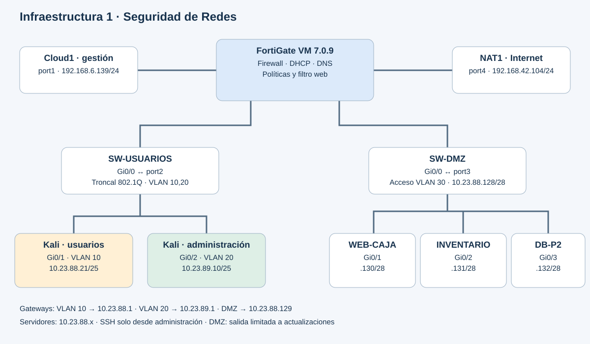

# Infraestructura 1 · DMZ y segmentación con FortiGate

**[Ver demostración en video](https://youtu.be/kfPXAiJ5qFk)**

**Axel Enrique Vasquez Peña · Matrícula 2024-2388**  
Semana 4 · Práctica 3 · Seguridad de Redes

Esta infraestructura separa usuarios, administración y servidores. FortiGate controla el tráfico entre las redes y limita la salida de la DMZ a los repositorios de actualización de Ubuntu. Dos aplicaciones PHP comparten una base de datos MariaDB para demostrar que los servicios autorizados siguen funcionando mientras se bloquean los accesos no permitidos.

El repositorio cubre exclusivamente **Infraestructura 1**. Incluye código, configuraciones, pruebas y capturas de la implementación.

## Topología

[Captura original de GNS3](evidencias/topologia-gns3.png). Algunos enlaces se superponen en esa captura; el diagrama lógico identifica los extremos según las configuraciones. La captura de GNS3 no se utiliza como prueba de que los equipos estén encendidos.

| Segmento / equipo | Dirección | Conexión |
|---|---|---|
| Gestión de FortiGate | 192.168.6.139/24, DHCP observado | port1 → Cloud1 |
| VLAN 10 · USUARIOS | 10.23.88.0/25; gateway 10.23.88.1 | VLAN 10 sobre port2 → SW-USUARIOS |
| VLAN 20 · ADMINISTRACIÓN | 10.23.89.0/25; gateway 10.23.89.1 | VLAN 20 sobre port2 → SW-USUARIOS |
| DMZ · VLAN 30 del switch | 10.23.88.128/28; gateway 10.23.88.129 | port3 → SW-DMZ Gi0/0 en acceso |
| WEB-CAJA | 10.23.88.130/28 | SW-DMZ Gi0/1 |
| WEB-INVENTARIO | 10.23.88.131/28 | SW-DMZ Gi0/2 |
| DB-P2 / dbp2 | 10.23.88.132/28 | SW-DMZ Gi0/3 |
| WAN de FortiGate | 192.168.42.104/24, DHCP observado | port4 → NAT1; gateway 192.168.42.1 |

Los clientes reciben DHCP de FortiGate: `.10–.126` en cada VLAN. Las pruebas muestran Kali usuarios en `10.23.88.21` y Kali administración en `10.23.89.10`. Los servidores usan direcciones estáticas y DNS `10.23.88.129`. La VLAN 30 existe en SW-DMZ; port3 de FortiGate es una interfaz física sin etiquetado VLAN 30.

## Política de seguridad

| ID | Política | Origen → destino | Servicio / resultado |
|---|---|---|---|
| 1 | VLAN20-SSH-DMZ | Administración → tres servidores | SSH permitido |
| 2 | VLAN20-WEB-DMZ | Administración → Caja e Inventario | HTTP permitido |
| 3 | VLAN10-BLOQUEO-INVENTARIO | Usuarios → Inventario | HTTP pasa por filtro web que bloquea la URL |
| 4 | VLAN10-WEB-CAJA | Usuarios → Caja | HTTP permitido |
| 5 | DMZ-DENY-VLAN10 | DMZ → Usuarios | Nuevas conexiones denegadas |
| 6 | DMZ-DENY-VLAN20 | DMZ → Administración | Nuevas conexiones denegadas |
| 7 | DMZ-ACTUALIZACIONES | Tres servidores → endpoints de Ubuntu | HTTP permitido, filtro web y NAT |
| 8 | DMZ-DENY-INTERNET | DMZ → WAN | Resto de conexiones denegado |

El filtro de Inventario genera la página de bloqueo visible: la política 3 tiene acción ACCEPT con perfil web. La regla 7 autoriza `archive.ubuntu.com`, `do.archive.ubuntu.com` y `security.ubuntu.com`, con rutas `/ubuntu/*`; el filtro termina con bloqueo del resto. Las respuestas de sesiones permitidas no requieren reglas inversas de permiso.

## Resultados documentados

| Prueba | Resultado observado | Evidencia |
|---|---|---|
| Usuarios abren Caja | Página funcional | [Captura](evidencias/caja-permitida.png) |
| Usuarios abren Inventario | Página de bloqueo local de FortiGate | [Captura](evidencias/inventario-bloqueado-vlan10.png) |
| Administración conecta a TCP/22 de los tres servidores | Los tres puertos abiertos | [Captura](evidencias/ssh-vlan20-permitido.png) |
| Usuarios conectan a TCP/22 de los tres servidores | Los tres intentos expiran | [Captura](evidencias/ssh-vlan10-denegado.png) |
| Inventario inicia tráfico hacia ambas VLAN | Denegado por políticas 5 y 6 | [Registro](evidencias/dmz-hacia-lan-denegado.png) |
| Inventario accede a example.com | Denegado por política 8 | [Registro](evidencias/internet-denegado.png) |
| Actualizar índices de Ubuntu | Descarga completada en Inventario; búsqueda de errores vacía en Caja y DB | [Inventario](evidencias/apt-inventario.png) · [Caja](evidencias/apt-caja-sin-errores.png) · [DB](evidencias/apt-db-sin-errores.png) |
| Resolver archive.ubuntu.com usando FortiGate | Resolución con respuesta | [Captura](evidencias/dns-dmz.png) |
| VLAN y port-security | VLAN correctas; una MAC por puerto, cero violaciones; troncal 10/20 activo | [Salidas transcritas](evidencias/verificacion-switches.txt) |

Un puerto SSH abierto prueba conectividad a TCP/22; la autenticación depende de la cuenta del servidor. Un timeout aislado no identifica la causa: los registros de FortiGate complementan las pruebas de denegación. La prueba APT actualiza índices; no demuestra que se hayan instalado todas las actualizaciones.

## Archivos

- [Guía de reproducción](docs/REPRODUCCION.md): preparación de equipos, aplicaciones y base de datos.
- [Configuración y alcance](docs/CONFIGURACION.md): reglas, filtros y decisiones de seguridad.
- [Pruebas y comandos](docs/PRUEBAS.md): validación técnica de la infraestructura.
- [Procedencia de archivos](docs/PROCEDENCIA.md): exportaciones originales y reconstrucciones identificadas.
- `apps/`: Caja e Inventario, con consultas preparadas, control CSRF y transacción para las ventas.
- `configs/`: respaldo FortiGate saneado, switches, VLAN, Netplan, Nginx y esquema MariaDB.
- `scripts/`: comprobaciones de conectividad y repositorios.
- `evidencias/`: capturas originales y transcripción de las salidas de los switches.

## Alcance y límites

Es un laboratorio GNS3 con FortiGate VM 7.0.9, IOSvL2 y Ubuntu Noble. Se utiliza HTTP para demostrar el filtrado solicitado. Las aplicaciones no implementan autenticación de usuarios y no se presentan como un despliegue de producción. Los tres servidores comparten VLAN y subred: su tráfico local, incluida la conexión a MariaDB, no atraviesa FortiGate. Las reglas del firewall no proporcionan aislamiento entre esos tres hosts.

Las claves, contraseñas y archivos privados de conexión no forman parte de la entrega. El respaldo de FortiGate contiene marcadores de sustitución y debe revisarse antes de cualquier restauración. No se distribuyen imágenes de sistemas operativos, licencias ni discos de máquinas virtuales.
